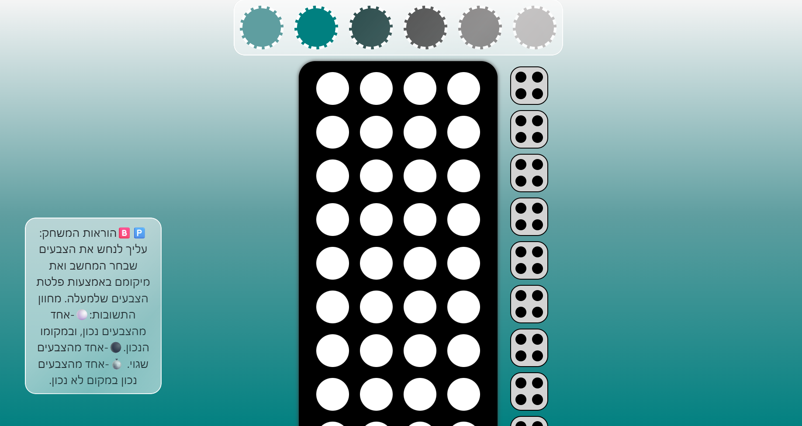
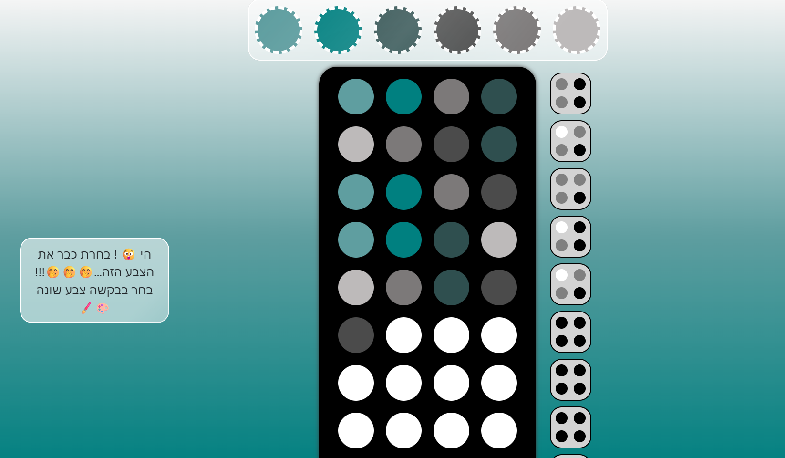
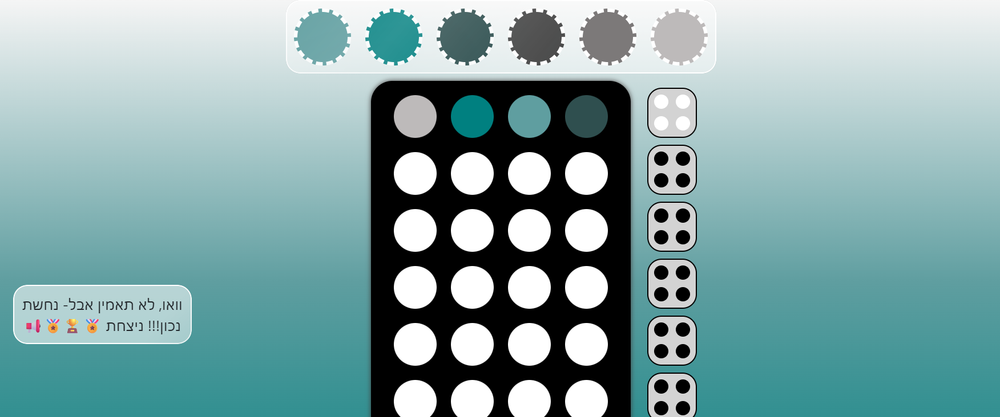

# Mastermind (Bulls and Cows) - Angular Game

משחק לוגיקה אינטראקטיבי המבוסס על המשחק הקלאסי "בול פגיעה". הפרויקט נבנה באמצעות **Angular** ומדגים יישום של אלגוריתמיקה בצד הלקוח וחווית משתמש דינמית.

## קישור למשחק רץ (Live Demo)
[לחצו כאן לצפייה במשחק רץ בענן](http://ayala-angular-boolpgiah-proj-testpnoren.s3-website.il-central-1.amazonaws.com/)

---

## תצוגת המשחק

| מסך פתיחה | מהלך המשחק |
| :---: | :---: |
|  |  |

| מסך ניצחון | מסך סיום משחק (הפסד) |
| :---: | :---: |
|  |  |

---

## על הפרויקט
המטרה במשחק היא לנחש רצף צבעים סודי שנבחר על ידי המחשב. לאחר כל ניסיון, המשתמש מקבל משוב:
* **Bull (בול):** צבע נכון במיקום הנכון.
* **Cow (פגיעה):** צבע שקיים ברצף אך נמצא במיקום שגוי.

### דגשים טכניים:
* **ניהול מצב (State Management):** מעקב אחר ניסיונות המשתמש, לוח התוצאות ומצבי המשחק השונים (פתיחה/משחק/סיום).
* **אלגוריתם השוואה:** פיתוח לוגיקה הבודקת את הניחוש מול הקוד הסודי ביעילות.
* **Responsive Design:** התאמת לוח המשחק לגדלי מסך שונים.

## טכנולוגיות
* **Framework:** Angular 20.1.3
* **Logic:** TypeScript
* **Styling:** CSS3 / Flexbox

---

## הרצה מקומית
1. התקנת תלויות: `npm install`
2. הרצת שרת פיתוח: `ng serve`
3. פתיחת הדפדפן בכתובת: `http://localhost:4200/`